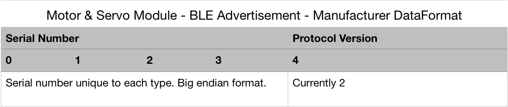
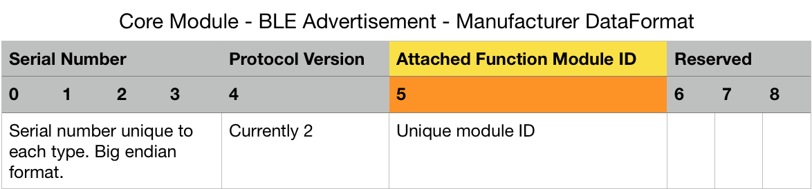

# Tinkamo Bluetooth Protocols

# Table of Module ID
Each type of module has its unique numeric ID. It is used in the BLE protocol to tell the type of the module.

0 Core
1 Button
2 Knob
3 Slider
4 Joystick (Analog)
5 Motor
6 Servo
11 Pixel Display (LED Matrix)
22 Path Finder
23 Distance Sensor
24 Sound Sensor
27 Color Sensor

# Discovering stage
When the module is powered on, not connected, the LED will blink in white. It keeps sending advertising data to allow the app to discover it.

In the BLE advertisement data, the **Local Name** is always set to "Tinka", which will be reflected as the BLE device name you have discovered. In another field called **Manufacturer Data**, there is extra encoded data about the serial number and attached module.

## Motor & Servo

## Core Module

# Connecting stage
When the module is connected to the app via BLE, the LED shows a steady color. It will not send advertisement data or allow other apps to find it until it is disconnected.

In this stage, you can interact with the module via BLE read, write or notify methods. The protocol is made of a fixed header, the gray part, and a various body, the orange part.

Below are the protocols for all modules.

## Motor

The sample BLE command string above lets the motor spin in full speed (Hex: 03 E8 or Oct: 1000) in counter-clockwise direction (FF).

## Servo

The sample BLE command string above lets the servo rotate to the right extreme (Hex: 5A or Oct: 180).
