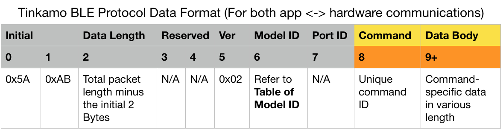
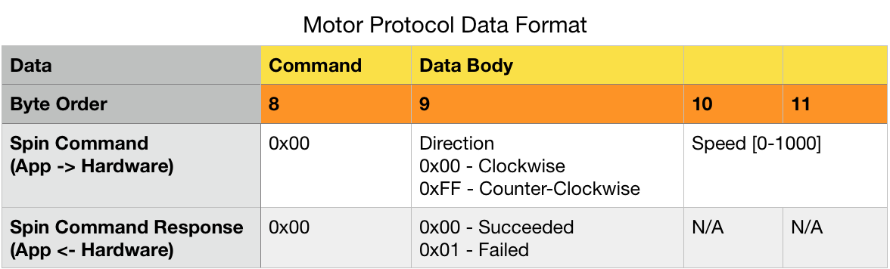
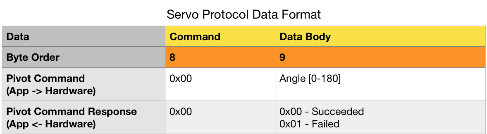
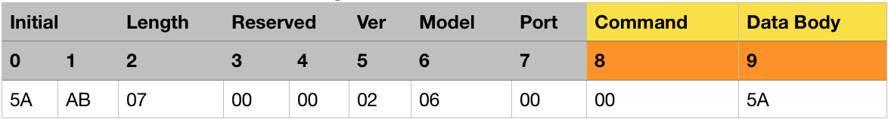

# Tinkamo Bluetooth Protocols

The protocol is made of a fixed header, the gray part, and a various body, the orange part.

## Motor

The sample BLE command string above lets the motor spin in full speed (Hex: 03 E8 or Oct: 1000) in counter-clockwise direction (FF).

## Servo

The sample BLE command string above lets the servo rotate to the right extreme (Hex: 5A or Oct: 180).
